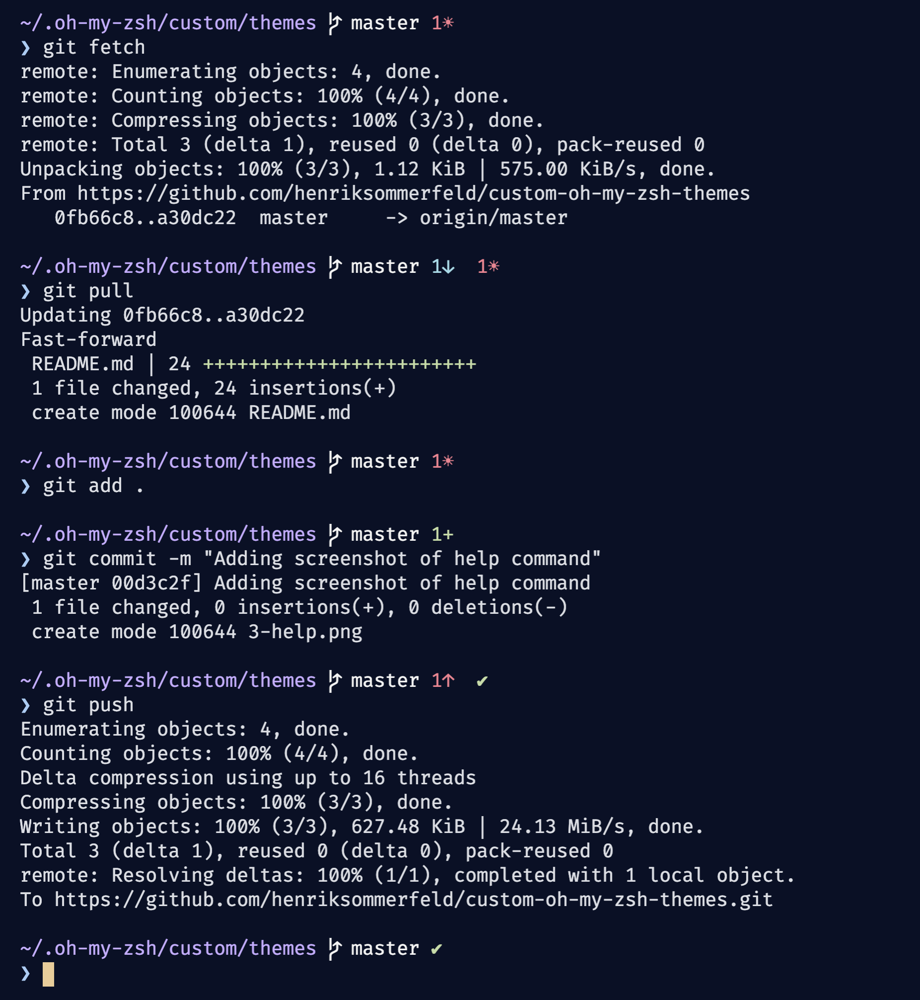
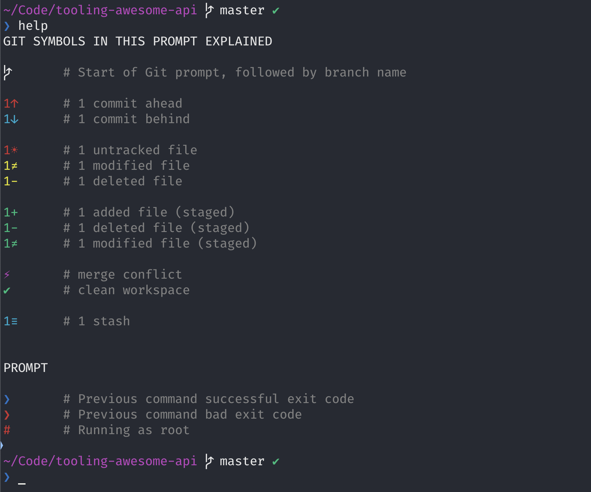

# Sommerfeld themes for Oh My ZSH

These are my custom themes for [Oh My ZSH](https://ohmyz.sh/). 

## [sommerfeld1.zsh-theme](./sommerfeld3.zsh-theme)

Basic theme that only uses existing variables for customisation.

## [sommerfeld2.zsh-theme](./sommerfeld3.zsh-theme)

Agnoster-like, basically [AgnosterZak for oh-my-zsh](https://github.com/zakaziko99/agnosterzak-ohmyzsh-theme). It's showing current temperature on a Raspberry Pi running Ubuntu 20.04.

## [sommerfeld3.zsh-theme](./sommerfeld3.zsh-theme)

The one I use. It's heavily inspired by [Josh Dick's prompt](https://joshdick.net/2017/06/08/my_git_prompt_for_zsh_revisited.html), not so much in the actual looks, but I liked his code structure. I like that the theme is quite mininal (compared to Agnoster), but still has detailed Git info.

Let's look at an example:

There is also a `help` command that explains the symbols I use

## Installation
Assuming you have a default installation of Oh My ZSH, you can install my themes like this, using `sommerfeld3.zsh-theme` as example:

1. Copy [sommerfeld3.zsh-theme](./sommerfeld3.zsh-theme) to `~/.oh-my-zsh/custom/themes`
2. Open `~/.zshrc` and set the theme variable like this: `ZSH_THEME="sommerfeld3"`. Save 💾
3. In the shell: `source ~/.zshrc`
4. Done. Navigate to a Git folder and see.

